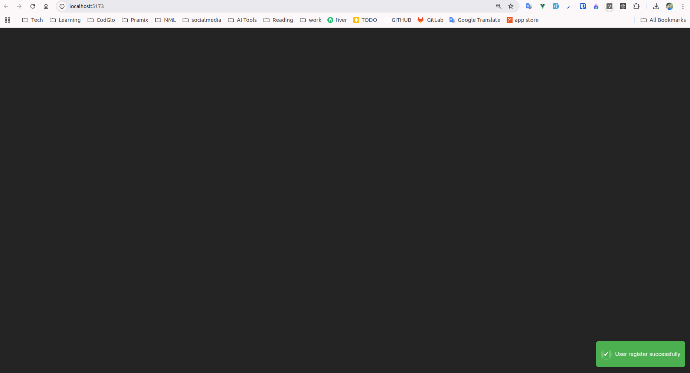

# psnotification

`psnotification` is a customizable notification component for Vue 3 that allows you to easily display notifications in various positions on the screen. You can pass different message strings, status types (such as success or error), and choose the notification position (e.g., top-right, bottom-left, etc.).

You can find the `psnotification` package on [npm](https://www.npmjs.com/package/psnotification).


## Installation

To install `psnotification`, run the following command:

```bash
npm install psnotification
```
## Usage
To use the notification component globally in your Vue 3 project, import it into your `main.js` (or `main.ts` if you're using TypeScript)

```bash
import PsNotification from "psnotification";
import "psnotification/dist/psnotification.css";

const app = createApp(App);
app.use(PsNotification);
app.mount("#app");

```

This will make the PsNotification component available for use throughout your project.

## Component Usage
You can now use the `PsNotification` component in any Vue component by including it in your template

```bash
<template>
  <PsNotification message="Hello, World!" status="success" position="top-right" />
</template>

<script setup>
import PsNotification from 'psnotification';
</script>
```

## Props

| Prop | Type | Description | Default |
| -------- | -------- | -------- | -------- |
| message | String | The text you want to display in the notification (required). | - |
| status | String | he status type for the notification (optional). Possible values: success, error, warning, info. | - |
| position | String |The position of the notification on the screen (optional). Possible values: top-right, | top-left |



